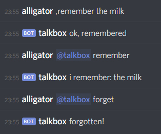
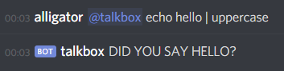

# talkbox
This is a javascript discord bot, designed to be simple and easy to extend.

## table of contents
- [running it](#running-it)
- [talking to it](#talking-to-it)
- [REPL](#repl)
- [writing plugins](#writing-plugins)
  - [simple](#simple)
  - [interval commands](#interval-commands)
  - [db](#db)
  - [API calls](#api-calls)
  - [config](#config)

## running it
Create a config.json file that looks like this:

```json
{
  "token": "API TOKEN HERE",
  "leader": ","
}
```

The token is your bot token, the leader is the character users have to put before commands, e.g. `,echo`.

Then run

    npm install
    npm run start

## talking to it
You can run a command by either using the leader or mentioning talkbox, like so:



You can also pipe commands into one another, for example:



## REPL
When you run talkbox you'll see a `talkbox>` prompt. This is a REPL you can use to interact with talkbox directly in the console.. This is a regular node REPL, so you can run any JavaScript you'd like. You have access to the [discord.js client object](https://discord.js.org/#/docs/main/stable/class/Client) as `client`.

For example, you could send a message to someone using their ID like this:

```
talkbox> client.users.get('USER_ID_HERE').send('test') 
```

### commands
There are some built in REPL commands to manage talkbox:

```
.run command          - run command as though it was a message sent to the bot. The reply is logged to the console
.plugins reload       - reload all plugins
.plugins stop         - stop watching the plugins directory (new commands won't be loaded)
.plugins start        - start watching the plugins directory
.guilds               - list the guilds the bot is in
.channels             - list the channels the bot is in
.send id message      - send message to the channel or user with id
.send_channel message - send message to the channel with the given name
```

## writing plugins
A plugin is a .js file in the plugins directory. talkbox monitors this directory and loads anything that's changed. You can add or update plugins at runtime.

### simple
Here's a simple plugin:

```js
function echo(text) {
  return `did you say ${text}?`;
}

echo._help = 'echo [text] - echoes the given text';

commands = { echo };
```

You register commands by setting the global `commands` object. The key is the name of the command and the value is the function to call.

The function is passed the text that followed the command, and anything returned from the function is sent to the channel the message came from.

The `_help` attribute lets you create a help message for the command. When a user runs `help <your command>`, they will see this message.

Here's a slightly more complex plugin:

```js
function echoLater(text, message) {
  setTimeout(() => {
    message.channel.send(`did you say ${text}?`);
  }, 6000);
  return 'echoing later...';
}

commands = { echoLater };
```

The second argument to the plugin is a [discord.js message object](https://discord.js.org/#/docs/main/stable/class/Message). From this you can get to the channel the message came from, the author, or the discord client itself. It's useful if you want to send multiple messages like above.

### interval commands
You can also create interval commands, which are run by talkbox on a timer. These get passed the [discord.js client object](https://discord.js.org/#/docs/main/stable/class/Client).

```js
function heartbeat(client) {
  const owner = client.users.get('1234');
  owner.send('i\'m still alive!!');
}

// interval is in ms, so this is every hour
heartbeat._interval = 60 * 60 * 1000;
```

talbox will register any function with a `_interval` property as an interval command.

### db
You can use the `db` global in a plugin to persist data. Here's a plugin that saves some data:

```js
function remember(text, message) {
  const name = message.author.username;

  if (text && text.length > 0) {
    db[name] = text;
    return 'ok, remembered';
  }

  if (name in db) {
    return `i remember: ${db[name]}`;
  }

  return 'nothing for me to remember';
}

function forget(text, message) {
  const name = message.author.username;
  if (name in db) {
    delete db[name]
    return 'forgotten!';
  }
  return 'nothing to forget';
}

commands = { remember, forget };

```

db works like a regular object, except it persists across restarts/reloads. The storage for each plugin is kept separate, so you don't have to worry about key collisions. The data is written to `persist.json`.

### API calls
Commands can easily make API calls and talkbox supports command functions being async. Here is an example plugin that fetches some data:

```js
const axios = require('axios');

async function novara() {
  const response = await axios.get('https://novaramedia.com/api/articles/');
  const article = response.data.posts[0];
  return `${article.title} - ${article.permalink}`;
}

commands = { novara };
```

### config
A plugin can read the config by just requiring the config.json file, like so:

```js
const config = require('../config.json');
```

The config file is a good place to store API keys, paths, and anything that you don't want to hard-code into a plugin.
